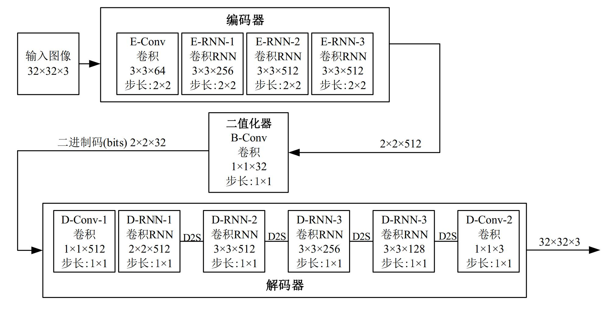

# Image-Compression-based-on-LSTM-network
*Graduation Project: Image Compression based on LSTM-pytorch implementation
*Jack Xu  

## Requirements
- PyTorch 0.2.x

## Train
`
python train.py -f /path/to/your/images/folder/like/mscoco
`
Used MS-COCO 2014 Dataset to train.You will get your encoder and decoder .pth file.

## Encode and Decode
### Encode
`
python encoder.py --model checkpoint/encoder_epoch_00000005.pth --input /path/to/your/example.png --cuda --output ex --iterations 16
`

This will output binary codes saved in `.npz` format.

### Decode
`
python decoder.py --model checkpoint/encoder_epoch_00000005.pth --input /path/to/your/example.npz --cuda --output /path/to/output/folder
`

This will output images of different quality levels.

## Test
### Get Kodak dataset
Using the pictures in test_pic folder.

### Encode and decode with RNN model
```bash
bash test/enc_dec.sh
```

### Encode and decode with JPEG (use `convert` from ImageMagick)
```bash
bash test/jpeg.sh
```
Want to compare with JPEG Method so I used JPEG.

### Calculate MS-SSIM and PSNR
See the detail in PSNR and MS-SSIM folder

### `network`

Network Outline



## What's inside
- `train.py`: Main program for training.
- `encoder.py` and `decoder.py`: Encoder and decoder.
- `dataset.py`: Utils for reading images.
- `metric.py`: Functions for Calculatnig MS-SSIM and PSNR.
- `network.py`: Modules of encoder and decoder.
- `modules/conv_rnn.py`: ConvLSTM module.
- `functions/sign.py`: Forward and backward for binary quantization.

## Official Repo
https://github.com/tensorflow/models/tree/master/compression
